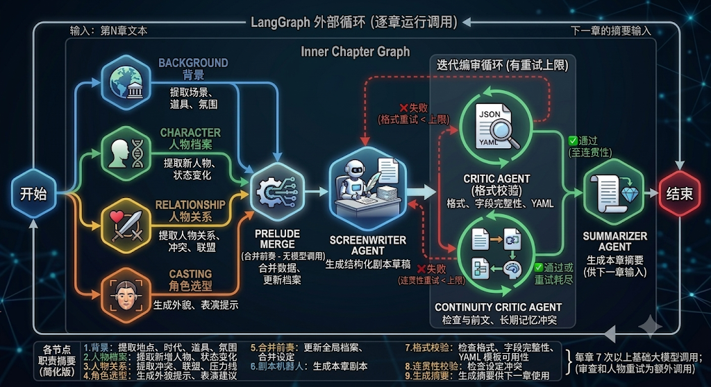

## 旧前端设计

前端位于 `index.html`、`styles.css`、`src/app.js`。

前端主要职责：

- 输入 `user_id`、`thread_id`、作品标题、改编方向、场景密度等参数。
- 粘贴小说文本，或上传 EPUB 并预览章节。
- 展示章节识别结果和字数信息。
- 调用后端流式接口，实时显示当前处理到第几章/分段。
- 接收每章生成结果，并追加到输出区域。
- 展示 manifest、统计信息、记忆摘要和场景预览。
- 支持复制和下载生成结果。

前端不直接调用大模型，不保存长期记忆，也不做复杂剧本逻辑。它负责提供清晰的创作入口和可视化反馈，核心生成与校验全部交给后端。

## 多Agent后端设计

后端采用 FastAPI 分层设计。

### API 层

| 接口 | 说明 |
| --- | --- |
| `GET /api/health` | 健康检查 |
| `POST /api/parse-epub` | 上传 EPUB，拆分章节并生成 metadata |
| `GET /api/get-chapter` | 读取已拆分的章节文本 |
| `GET /api/scripts/projects` | 列出已解析的 EPUB 项目 |
| `POST /api/scripts/convert` | 直接将粘贴文本转换为 YAML |
| `POST /api/scripts/convert-project` | 项目式转换，非流式返回 |
| `POST /api/scripts/convert-project-stream` | 项目式转换，流式返回章节进度和结果 |
| `GET /api/scripts/memory/{user_id}/{thread_id}` | 查看记忆快照 |
| `POST /api/scripts/memory/clear` | 清除指定用户和线程的记忆 |

### Service 层

- `chapter_splitter.py`：识别“第一章/第二章/Chapter 1”等章节标题，必要时按长度自动分段。
- `script_project_service.py`：项目式逐章生成，负责调用 LangGraph、保存 `plot_000x.txt`、生成 `manifest.json`。
- `memory_store.py`：将短期和长期记忆保存为 JSON。
- `vector_memory.py`：将人物、设定、关系、伏笔等写入 RAG 长期记忆。
- `yaml_builder.py`：将结构化数据转换为 YAML。

### Agent 层

`app/agent/script_graph` 是本项目的核心智能工作流。它将“读小说、抽档案、写剧本、检查、总结”拆成多个节点，避免一个模型调用承担过多任务。

## LangGraph 工作流设计

每一章都会运行一次 LangGraph。外层循环负责逐章调用，图内部负责当前章节的多 Agent 处理。



### 各节点职责

| 节点 | 是否调用模型 | 作用 |
| --- | --- | --- |
| `Background` | 是 | 提取地点、时代、组织、道具、服装、氛围、世界规则等背景信息 |
| `Character` | 是 | 提取本章新增人物和本章人物状态变化 |
| `Relationship` | 是 | 提取人物关系、冲突、联盟、压力线 |
| `Casting` | 是 | 生成角色选型、造型、表演提示 |
| `Prelude Merge` | 否 | 合并前四个节点输出，更新全局人物和设定档案 |
| `Screenwriter` | 是 | 真正输出本章结构化剧本草稿 |
| `Critic` | 是 | 检查格式、字段完整性、YAML 模板可用性 |
| `Continuity Critic` | 是 | 检查本章与前文、长期记忆、人物设定是否冲突 |
| `Summarizer` | 是 | 生成本章之后的滚动摘要，供下一章使用 |

正常情况下，每章大约 7 次模型调用。若 `Critic` 或 `Continuity Critic` 触发重写，会额外调用 `Screenwriter` 和审查节点。若 `Character` 结构化输出失败，会用更短上下文重试一次，仍失败则跳过本章人物档案更新，保证项目继续运行。

## 为什么按章节生成

长篇小说不能一次性塞给模型。项目采用章节级流水线，原因是：

- 控制上下文长度，降低模型输出截断和 JSON 解析失败概率。
- 失败时可以定位到具体章节或分段。
- 每章完成后立即落盘，避免后续章节失败导致前面结果丢失。
- 逐章更新短期摘要和长期记忆，使后续章节保持连续。
- 允许作者先获得可编辑 draft，再进行人工打磨或二次审查。

当前流程是“章节级检查后输出章节 draft”。如果后续需要“全书级总审”，可以在所有章节生成完后增加 `Book Final Critic`，读取 manifest、全部章节摘要、长期人物档案和未解决线索，输出全书问题报告或最终修订建议。

## 记忆与 RAG 设计

### JSON 长短期记忆

普通记忆保存位置：

```text
data/memory/{user_id}/{thread_id}.json
```

结构包括：

```json
{
  "short_term": {
    "window_chapters": 2,
    "recent_chapters": []
  },
  "long_term": {
    "book_title": "",
    "logline": "",
    "characters": {},
    "locations": {},
    "canon_facts": [],
    "unresolved_threads": []
  }
}
```

短期记忆用于相邻章节衔接，长期记忆用于保存人物、地点、事实和伏笔。

### RAG 向量记忆

RAG 记忆保存位置：

```text
data/vector_memory
```

如果 ChromaDB 可用，使用：

```text
data/vector_memory/chroma
```

如果 ChromaDB 不可用，使用 JSON fallback：

```text
data/vector_memory/json/{namespace}.json
```

每章完成后，系统会把重要人物、设定、关系、伏笔、角色状态变化写入 RAG 记忆。下一章生成时只检索少量相关长期记忆，而不是把全部历史直接塞进 Prompt。

这样设计的原因是：短期直接上下文保持轻量，长期信息按需取回，避免越生成到后面 Prompt 越膨胀。

## 输出文件

项目式转换会写入：

```text
data/script_outputs/{user_id}/{book_title}_{thread_id}_{timestamp}/
```

目录内主要文件：

```text
plot_0001.txt
plot_0002.txt
plot_0003.txt
manifest.json
```

其中：

- `plot_000x.txt`：第 x 个章节/分段的剧本初稿。
- `manifest.json`：全书生成清单，包含章节标题、源文件、场景数、摘要、审查警告、记忆写入数量等。

## YAML Schema 设计

题目要求额外定义剧本 YAML Schema，并说明设计原因。本项目的详细文档在：

```text
docs/yaml_schema.md
```

项目同时使用 `template.yaml` 作为每章输出的用户侧模板。当前章节级输出核心结构如下：

```yaml
书名: string
章节: string
背景设定: string
出场人物:
  - 姓名: string
    身份: string
    性格: string
场景列表:
  - 场景序号: integer
    发生地点: string
    发生时间: string
    场景人物:
      - string
    剧情动作: string
    对话:
      - 说话人: string
        情感: string
        台词: string
```

### 为什么这样设计

1. 面向作者编辑，而不是只面向机器  
   YAML 比 JSON 更容易阅读和手工修改，也比纯文本更适合程序继续处理。

2. 以“场景”为核心  
   剧本创作的基本单位是场景。`场景列表` 将小说叙述拆成可拍摄、可调度、可审查的结构。

3. 保留人物表  
   `出场人物` 让作者快速看到本章涉及的人物身份和性格，便于后续统一修改人物设定。

4. 强制可拍摄动作  
   `剧情动作` 避免模型只复述心理描写，要求其转成动作、调度、道具、空间和视觉信息。

5. 台词结构化  
   `说话人 / 情感 / 台词` 便于作者后续单独调整对白、语气和潜台词。

6. 支持分批生成  
   长篇小说需要逐章处理。章节字段、场景字段和 manifest 可以把分批生成结果重新汇总。

7. 支持后续扩展  
   `docs/yaml_schema.md` 中保留了更完整的 project/source/memory/characters/locations/script/review_notes 结构，便于未来扩展到全书级总审、人物小传和制作计划。

## API 示例

### 直接文本转换

```http
POST /api/scripts/convert
```

```json
{
  "user_id": "author_demo",
  "thread_id": "adaptation_001",
  "novel_text": "第一章 ...\n\n第二章 ...\n\n第三章 ...",
  "title": "雨灯档案",
  "target_format": "web_series",
  "adaptation_tone": "现实感、强冲突、可拍摄",
  "scene_density": 3,
  "chapters_per_episode": 3,
  "short_term_window": 2
}
```

### EPUB 项目式流式转换

先上传 EPUB：

```http
POST /api/parse-epub
```

再调用流式转换：

```http
POST /api/scripts/convert-project-stream
```

```json
{
  "user_id": "author_demo",
  "thread_id": "adaptation_001",
  "project_path": "静默的铁证(米烛光著)",
  "title": "静默的铁证",
  "target_format": "web_series",
  "adaptation_tone": "现实感、强冲突、可拍摄",
  "scene_density": 3,
  "short_term_window": 2,
  "max_chunk_chars": 8000,
  "max_retries": 2
}
```

流式事件示例：

```json
{"event": "start", "book_title": "静默的铁证", "unit_count": 12}
{"event": "unit_start", "unit_index": 1, "chapter_title": "第一章"}
{"event": "unit_done", "unit_index": 1, "act": {}, "plot_text": "..."}
{"event": "done", "data": {}}
```

## 稳定性策略

项目针对长文本和结构化输出做了多层防护：

- 每章/分段处理，避免整本小说一次性进入模型。
- `max_chunk_chars` 控制单次文本规模，默认 8000 字符。
- Prompt 中只直接传上一章摘要、压缩人物档案和少量 RAG 结果。
- `CharacterOutput` 限制人物数量、关系数量和文本长度，减少 JSON 截断。
- 前置分析节点失败时可降级为空更新，不直接中断整本生成。
- `Screenwriter` 输出后经过格式检查和连续性检查。
- 每章完成后立即保存，降低长任务失败损失。

## 测试

推荐使用 Python 3.11 环境运行测试：

```bash
python -m py_compile app/agent/script_graph/memory_ops.py app/agent/script_graph/schemas.py app/agent/script_graph/nodes.py app/agent/script_graph/workflow.py app/agent/script_graph/prompts.py
python -m unittest discover -s tests_py
```

测试主要覆盖章节拆分、Schema 校验、LangGraph 编排和项目服务逻辑。真实大模型调用需要 `.env` 中配置可用 API Key。

## 使用建议

- 输入至少 3 章小说文本，章节标题尽量使用“第一章”“第二章”等清晰格式。
- 长章节建议保持默认分段上限 `8000`，以降低模型输出截断风险。
- 每个新项目使用独立 `thread_id`，避免不同作品的记忆混在一起。
- AI 输出是剧本初稿，不是最终定稿；作者应继续检查人物动机、伏笔回收、节奏和台词。

## 当前能力边界

当前系统已经支持章节级生成、章节级审查和全书 manifest 汇总。尚未实现全书生成后的统一总审节点。如果需要更完整的生产流程，可以继续扩展：

- `Book Final Critic`：全书级剧情、人物弧线、伏笔回收和节奏审查。
- `Revision Planner`：根据总审报告给出逐章修改计划。
- `Final Exporter`：将章节 draft 汇总为最终版 YAML 或标准剧本格式。
