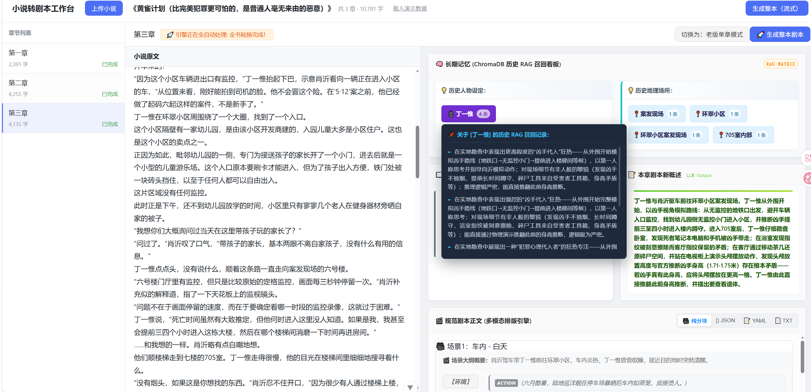
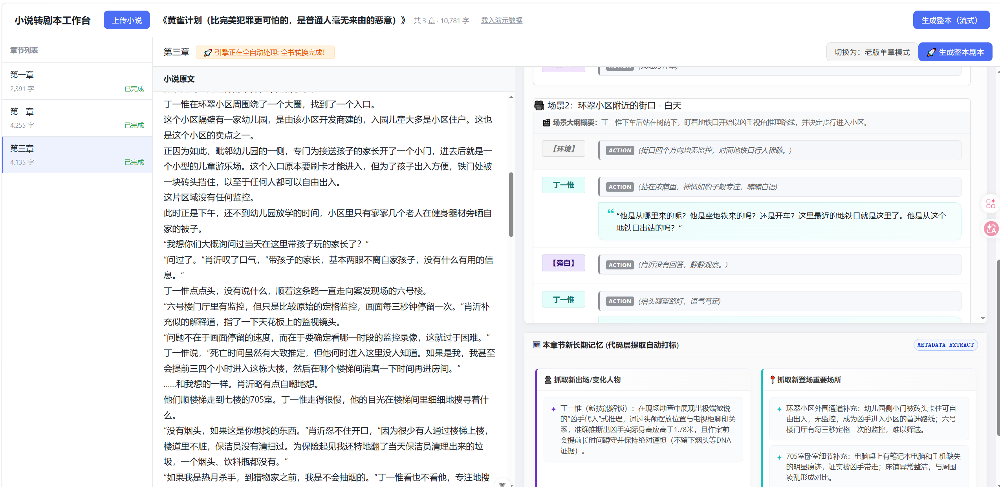
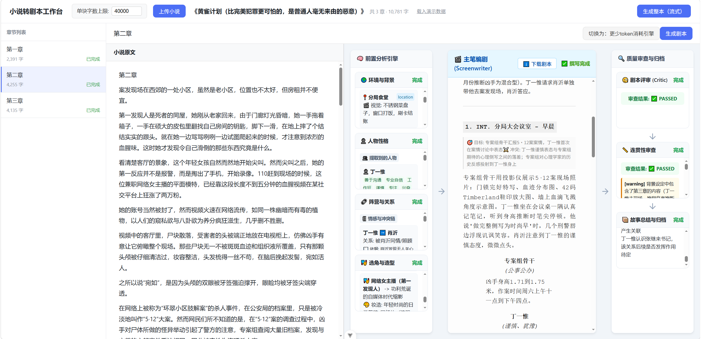

# 🎬 Novel2Script_AI (智能剧本工坊)

[](https://vuejs.org/)[](https://vitejs.dev/)[](https://pinia.vuejs.org/)[](LICENSE)[](https://www.python.org/)[](https://www.trychroma.com/)[](https://fastapi.tiangolo.com/)[](https://openai.com/)
> **语言版本 / Languages:** [简体中文](./README.md) | [English](./docs/README-en.md)

`Novel2Script_AI` 是一款 **AI 原生代工业级编剧工作站**。系统基于大语言模型（LLM）与向量数据库（ChromaDB）的 RAG 召回技术，能够将长篇小说全自动、高颗粒度地解构并重塑为符合电影工业规范的标准分镜头脚本。

---
## 🖥️ 界面预览



## 🚀 核心功能亮点
项目核心围绕 **「双层 AI 记忆模型」** 与 **「工业级分镜」** 展开，从根本上解决大语言模型（LLM）在长篇小说改编剧本时面临的“上下文遗忘、剧情跑偏、格式混乱”等行业痛点。

用户可以上传或粘贴小说文本，系统会按章节/分段逐步调用大模型，将小说内容转换为可编辑的剧本初稿。每章输出独立的 plot_000x.txt，同时生成 manifest.json 记录全书生成状态、章节摘要、场景数、记忆状态和审查结果。

我们采用双模式方法，一个采用多Agent方法，使用 LangGraph 编排背景、人物、关系、选型、编剧、审稿、连续性检查和摘要节点（消耗Token更多）；一个采用单Agent方法，使用RAG方法与提示词工程进行小说人物地点的记忆以及故事的流程编排（消耗Token更少）。
### 🧠 1. 基于双路 RAG 的长期实体记忆仓
* **实体级记忆持久化**：系统在底层建立独立的人物设定池与地理场所池。在处理每一章时，AI 会自动从向量库中跨时空调取相关的历史线索。
* **状态动态进化打标**：长效追踪剧情发展。当有全新人物或地点登场时，系统会自动持久化录入；若既有老人物、老地点的状态或行为模式发生更迭（如深化、负伤、关系转变），系统将实时动态更新写入记忆仓，彻底解决长文本下 LLM “前言不搭后语” 的幻觉问题。

### 📖 2. 故事主线动态留存的短期记忆
* **剧情概述承启轴**：每一章节在生成过程中，AI 会同步提炼并沉淀本章的剧情备忘录。
* **全局主线强约束**：通过精简的短期记忆体，在生成下一章节时强制喂给大模型作为上下文输入。让 LLM 时刻感知当前最新的故事发展状况、掌握剧情核心脉络，死死锁住故事走向，绝不脱离整体主线轨道。

### 🎥 3. 工业级标准剧本分镜流水线
* **场景结构化切片**：正文彻底告别传统小说的纯文本堆砌，严格按照电影工业标准以“场景”为核心单元进行结构化排版。
* **角色/动作/台词独立成舱**：客观环境描述、角色舞台动作、主观台词对白均拥有独立的视觉卡片包裹。相同角色的对白舱采用专属动态色系映射，多人混战对话一目了然。
* **原文段落精准回溯**：每一段分镜场景都具备段落锚点，能够实时精准反向对应到原始小说中的具体段落（`[p_i]`），方便编剧或导演随时肉眼比对原作修正。

### 📂 4. 电子书（EPUB）智能解构与章节治理
* **原生结构完美解析**：系统无缝支持 `.epub` 标准电子书格式文件输入。
* **全自动断章流水线**：一键将数万字甚至数十万字的长篇小说按原始章节目录进行多线程智能拆解与高颗粒度治理，将其解构为适合大模型吞吐的黄金上下文切片。
---

## 🛠️ 技术栈蓝图

本工作站采用现代前后端完全解耦的架构，前端聚焦于多模态响应式排版与状态锁闭环，后端聚焦于图网络状态机与记忆检索沉淀。

### 💻 前端技术栈 (Frontend Hub)
* **核心框架**：`Vue 3` (采用 Setup 语法糖与 SFC 规范，保证组件高内聚)
* **工程脚手架**：`Vite` (提供微秒级极速 HMR 热更新与工业级编译优化)
* **状态存储桶**：`Pinia` (全局状态集散中心，实现章节快照数据的绝对隔离存储)
* **流式数据总线**：`Server-Sent Events (SSE)` (原生轻量级长连接，支撑高性能碎字流式吐字)

### 🐍 后端技术栈 (Backend Core)
* **开发语言**：`Python 3.10+` (强类型声明与异步并发控制)
* **Agent 编排引擎**：`LangGraph` (基于状态图的有向图网络拓扑治理方案，负责节点流转与自愈条件拦截)
* **本地向量底座**：`ChromaDB` (轻量化高持久化嵌入向量数据库，负责历史 RAG 实体记忆持久化)
* **大模型驱动**：`OpenAI SDK` / `DeepSeek API` (提供长上下文深度推理基座与高经济性流式文本输出)
---

## 🚀 快速通车指南

### 1. 克隆与环境准备
```bash
# 克隆仓库
git clone [https://github.com/your-username/novel2script-ui.git](https://github.com/your-username/novel2script-ui.git)
# 安装后端依赖
pip install -r requirements.txt
# 启动后端
uvicorn app.main:app --reload --port 8000
# 进入前端项目目录
cd novel2script-ui
# 前端依赖安装
npm install
# 前端启动
npm run dev

```
启动成功后，打开浏览器访问 http://localhost:5173 即可进入控制台。
点击上传剧本后，再点击生成整本剧本即可看到剧本的整体生成。

## 📦 项目模块骨架

本系统由后端核心服务（FastAPI + LangGraph）与前端交互工作台（Vue 3 + Vite）共同构成。以下为完整的工程资产目录树：

### 🐍 1. 后端骨架 (Python + FastAPI Core)

```text
feiniuyun/
├── app/                                # 🚀 主应用核心内胆
│   ├── __init__.py
│   ├── main.py                         # FastAPI 服务网关入口
│   │
│   ├── api/                            # 🛣️ 路由控制层 (RESTful API)
│   │   ├── __init__.py
│   │   ├── health.py                   # 节点生命周期健康检查
│   │   ├── epub.py                     # EPUB 电子书解析分片接口
│   │   └── script_routes.py            # 剧本项目级综合路由
│   │
│   │
│   └── services/                       # ⚙️ 业务逻辑层 (纯服务流水线)
│       ├── __init__.py
│       ├── epub_hand.py                # EPUB 文件物理二进制提取
│       └── novel_converter.py          # 小说文本结构化矩阵转换
│
├── configs/                            # 🎛️ 静态提示词与环境策略配置目录
│   └── prompts_config.json            # LLM 系统提示词 + 用户提示词模板
│
├── data/                               # 💾 数据持久化底座
│   ├── chroma_db/                      # ChromaDB 本地向量数据库仓
│   └── temp_epubs/                     # 临时上传的电子书暂存区
│
├── requirements.txt                    # 依赖清单
├── .env                                # 本地敏感密钥环境变量
└── README.md                           # 后端独立自述说明
```
### 💻 2. 前端骨架 (Vue 3 + Vite + Pinia Dashboard)
``` text
feiniuyun/novel2script-ui/
├── index.html                          # 单页面应用 (SPA) 主入口
├── vite.config.js                      # Vite 构建管线与工程反向代理配置
├── jsconfig.json                       # 路径别名 (@/*) 自动化检索配置
├── package.json                        # 前端第三方生态依赖依赖管理
│
├── public/                             # 🎨 离线静态底层全局资产
└── src/
    ├── main.js                         # Vue 应用初始化引导入口
    ├── App.vue                         # 挂载渲染根组件
    │
    ├── router/                         # 🛣️ 单页视图路由导航网
    │   └── index.js
    │
    ├── stores/                         # 📦 状态控制总仓 (Pinia State)
    │   └── novelStore.js               # 核心快照隔离存储桶 (解决串台 Bug)
    │
    ├── api/                            # 📡 异步网络总线
    │   └── backend.js                  # Axios 后端 RESTful 统一映射
    │
    ├── services/                       # 🌊 长连接流式传送带
    │   └── sseService.js               # SSE 长连接高频事件收音机
    │
    ├── composables/                    # 🧪 组合式逻辑抽象 (Vue Use)
    │   └── useNovelStream.js           # 封装高频蹦字流式生命周期
    │
    ├── views/                          # 🖼️ 工作台大视图看板
    │   └── WorkbenchView.vue           # AI 编剧核心中央工作台
    │
    ├── components/                     # 🧩 复用高内聚 UI 组件库
    │   ├── NovelUploader.vue           # 拖拽式 EPUB 小说上传舱
    │   ├── ChapterList.vue             # 智能联动目录目录树树
    │   ├── ScriptPreview.vue           # 剧本正文视窗容器
    │   ├── ProjectStream.vue           # 转换日志流式观察哨
    │   │
    │   └── workbench/                  # 🎛️ 工作台子模块高定专区
    │       ├── NovelViewer.vue         # 小说原文等宽滚动阅览器
    │       ├── AiDashboard.vue         # AI 控制中心多模态主板
    │       └── ai-dashboard-modules/   # 🌟 看板细分高阶组件
    │           ├── MemoryExtractor.vue # 增量长期记忆自动打标块
    │           ├── MemoryMatrix.vue    # RAG 左右并列实体悬浮窗胶囊墙
    │           ├── ScriptViewer.vue    # 多模态剧本正文切换面板
    │           └── StoryProgress.vue   # 剧情承启（前情与新概述）蓝图卡
    │
    └── utils/                          # 🧰 前端静态纯函数工具箱
        ├── download.js                 # 剧本一键结构化导出
        ├── highlightYaml.js            # 极客终端高亮着色器
        └── scriptParsers.js            # 碎字抢救正则解析器
```

## 旧后端前端视频演示

【ai小说转剧本】 https://www.bilibili.com/video/BV16ME464Egu/?share_source=copy_web&vd_source=ea2deb3030977806a732ef9a011db4b2